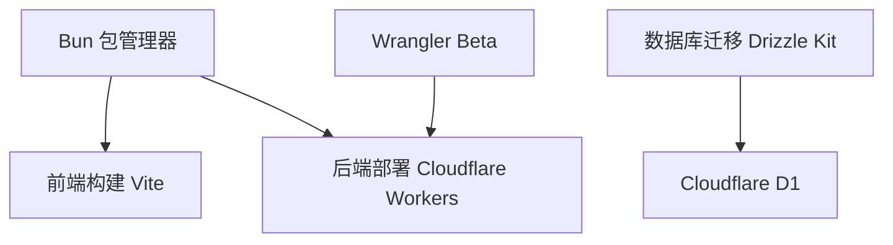

# Rin 项目架构重构计划

## 当前问题分析

### 1. 包管理器不一致
- 使用 Bun 作为主包管理器
- 但 Wrangler 需要 Node.js 才能运行
- 开发者需要同时安装两个运行时环境

### 2. 环境变量配置分散且复杂
```
├── .dev.example.vars      # 开发环境变量示例
├── .dev.vars              # 开发环境变量（本地）
├── client/.env.example    # 前端环境变量示例
├── client/.env            # 前端环境变量（本地）
├── server/.env            # 后端环境变量（本地测试）
├── wrangler.example.toml  # Wrangler 配置示例
└── wrangler.toml          # Wrangler 配置
```

### 3. 开发体验不友好
- 需要启动多个终端运行不同服务
- 端口分散：前端 5173，后端 11498
- 迁移脚本复杂，需要手动管理

---

## 重构目标

1. **统一包管理器**：完全使用 Bun，移除 Node.js 依赖
2. **环境变量集中管理**：单一配置文件，开箱即用
3. **一键启动开发**：单个命令启动所有服务
4. **自动化配置验证**：启动前自动检查配置完整性

---

## 重构方案

### 方案一：完全拥抱 Bun 生态（推荐）

#### 1. 包管理器统一

**方案**：使用 `wrangler@beta`（Bun 原生支持）或寻找替代工具



**依赖变更**：
- 移除所有 Node.js 依赖
- 使用 `wrangler@next`（Bun 原生版本）
- 或评估替代方案如 `cloudflare-worker-deploy`

#### 2. 环境变量集中管理

**方案**：创建统一的 `.env` 文件，通过脚本分发

```
.env                          # 主配置文件
├── 通用配置
├── 前端配置
├── 后端配置
└── 敏感配置（.gitignore）
```

**脚本自动生成**：
```bash
scripts/config-sync.sh         # 将主配置同步到各个子项目
```

**文件结构变更**：
```
.env.example                   # 环境变量模板（开源）
.env                           # 本地开发配置（.gitignore）
├── RENOVATE_BOT_TOKEN         # 可选：机器人令牌
├── RIN_GITHUB_CLIENT_ID       # OAuth 客户端 ID
├── RIN_GITHUB_CLIENT_SECRET   # OAuth 客户端密钥
├── JWT_SECRET                 # JWT 密钥
├── S3_ACCESS_KEY_ID           # S3 访问密钥
├── S3_SECRET_ACCESS_KEY       # S3 密钥
├── S3_ENDPOINT                # S3 端点
├── S3_BUCKET                  # S3 存储桶
├── S3_REGION                  # S3 区域
├── S3_ACCESS_HOST             # S3 访问域名
├── FRONTEND_URL               # 前端地址
├── API_URL                    # 后端 API 地址
└── DATABASE_PATH              # 本地数据库路径
```

#### 3. 一键启动开发

**新增脚本** `scripts/dev.sh`：
```bash
#!/bin/bash
set -e

# 1. 检查并安装依赖
bun install

# 2. 运行数据库迁移
bun run db:migrate

# 3. 启动前端开发服务器
bun run dev:client &

# 4. 启动后端开发服务器
bun run dev:server &

# 5. 等待用户中断
wait
```

#### 4. 配置文件简化

**wrangler.toml** 保持最小化：
```toml
name = "rin-server"
main = "server/src/_worker.ts"
compatibility_date = "2024-05-29"
node_compat = true

[triggers]
crons = ["*/20 * * * *"]

[vars]
# 动态注入的环境变量
```

---

## 实施步骤

### 阶段一：环境变量集中化

1. 创建统一的 `.env.example` 模板
2. 创建 `scripts/config-sync.ts` 自动同步配置到子项目
3. 更新 `.gitignore` 排除敏感配置
4. 验证配置完整性检查脚本

### 阶段二：包管理器统一

1. 调研 `wrangler@beta` 的稳定性
2. 或评估替代部署工具
3. 更新 `package.json` 中的构建脚本
4. 测试本地开发流程

### 阶段三：开发体验优化

1. 创建 `scripts/dev.sh` 一键启动脚本
2. 添加配置验证步骤
3. 改进错误提示信息
4. 更新文档

### 阶段四：文档与自动化

1. 更新 `README.md` 简化部署说明
2. 更新 `docs/DEPLOY.md`
3. 创建配置验证工具
4. 添加 CI/CD 优化

---

## 详细实施任务

### 任务 1.1：创建统一环境变量模板

**文件**: `.env.example`

```bash
# ==================== 通用配置 ====================
NODE_ENV=development

# ==================== 前端配置 ====================
VITE_API_URL=http://localhost:11498
VITE_NAME=Your Name
VITE_AVATAR=https://avatars.githubusercontent.com/u/36541432
VITE_DESCRIPTION=Your Description
VITE_PAGE_SIZE=5

# ==================== 后端配置 ====================
# 数据库
DATABASE_PATH=./data/dev.db

# OAuth
RIN_GITHUB_CLIENT_ID=
RIN_GITHUB_CLIENT_SECRET=

# JWT
JWT_SECRET=

# S3 存储
S3_BUCKET=
S3_REGION=auto
S3_ENDPOINT=
S3_ACCESS_HOST=
S3_ACCESS_KEY_ID=
S3_SECRET_ACCESS_KEY=

# 前端地址（用于 Webhook 通知）
FRONTEND_URL=http://localhost:5173
```

### 任务 1.2：创建配置同步脚本

**文件**: `scripts/config-sync.ts`

```typescript
#!/usr/bin/env bun

import { readFileSync, writeFileSync, existsSync } from "fs";
import { resolve } from "path";

const ROOT_ENV = ".env";
const CLIENT_ENV = "client/.env";
const SERVER_ENV = "server/.env";
const WRANGLER_VARS = "wrangler.vars";

function loadEnv(path: string): Record<string, string> {
    if (!existsSync(path)) return {};
    const content = readFileSync(path, "utf-8");
    const env: Record<string, string> = {};
    for (const line of content.split("\n")) {
        const trimmed = line.trim();
        if (!trimmed || trimmed.startsWith("#")) continue;
        const [key, ...valueParts] = trimmed.split("=");
        if (key) env[key.trim()] = valueParts.join("=").trim();
    }
    return env;
}

function saveEnv(path: string, env: Record<string, string>) {
    const lines = Object.entries(env).map(([k, v]) => `${k}=${v}`);
    writeFileSync(path, lines.join("\n") + "\n");
}

// 主配置
const rootEnv = loadEnv(ROOT_ENV);

// 同步到客户端
const clientEnv: Record<string, string> = {
    API_URL: rootEnv.VITE_API_URL,
    AVATAR: rootEnv.VITE_AVATAR,
    NAME: rootEnv.VITE_NAME,
    DESCRIPTION: rootEnv.VITE_DESCRIPTION,
    PAGE_SIZE: rootEnv.VITE_PAGE_SIZE,
};
saveEnv(CLIENT_ENV, clientEnv);

// 同步到服务端
const serverEnv: Record<string, string> = {
    ...rootEnv,
    DB_PATH: rootEnv.DATABASE_PATH,
};
delete serverEnv.VITE_API_URL;
delete serverEnv.VITE_NAME;
delete serverEnv.VITE_AVATAR;
delete serverEnv.VITE_DESCRIPTION;
delete serverEnv.VITE_PAGE_SIZE;
saveEnv(SERVER_ENV, serverEnv);

// 生成 wrangler.vars（非敏感配置）
const wranglerVars: Record<string, string> = {
    FRONTEND_URL: rootEnv.FRONTEND_URL,
    S3_BUCKET: rootEnv.S3_BUCKET,
    S3_REGION: rootEnv.S3_REGION,
    S3_ENDPOINT: rootEnv.S3_ENDPOINT,
    S3_ACCESS_HOST: rootEnv.S3_ACCESS_HOST,
    S3_FOLDER: "images/",
    S3_CACHE_FOLDER: "cache/",
};
saveEnv(WRANGLER_VARS, wranglerVars);

console.log("✅ 配置已同步到子项目");
```

### 任务 2.1：评估并选择部署工具

需要调研的选项：
1. `wrangler@beta` - Cloudflare 官方的 Bun 支持
2. `cloudflare-worker-deploy` - 社区方案
3. 保持现状但优化脚本

### 任务 3.1：创建一键启动脚本

**文件**: `scripts/dev.sh`

```bash
#!/bin/bash
set -e

# 颜色输出
RED='\033[0;31m'
GREEN='\033[0;32m'
YELLOW='\033[1;33m'
NC='\033[0m'

echo -e "${GREEN}🚀 启动 Rin 开发环境${NC}\n"

# 1. 检查 Bun
if ! command -v bun &> /dev/null; then
    echo -e "${RED}❌ Bun 未安装，请先安装 Bun:${NC}"
    echo "   curl -fsSL https://bun.sh/install | bash"
    exit 1
fi

# 2. 检查配置
if [ ! -f ".env" ]; then
    echo -e "${YELLOW}⚠️  未找到 .env 文件，正在从模板创建...${NC}"
    cp .env.example .env
    echo -e "${YELLOW}📝 请编辑 .env 文件配置必要的环境变量${NC}"
    exit 1
fi

# 3. 同步配置
echo -e "${GREEN}📋 同步配置...${NC}"
bun run config:sync

# 4. 安装依赖
echo -e "${GREEN}📦 安装依赖...${NC}"
bun install

# 5. 数据库迁移
echo -e "${GREEN}🗄️  运行数据库迁移...${NC}"
bun run db:migrate

# 6. 启动服务
echo -e "${GREEN}🌐 启动前端开发服务器 (http://localhost:5173)${NC}"
bun run dev:client &

echo -e "${GREEN}⚡ 启动后端开发服务器 (http://localhost:11498)${NC}"
bun run dev:server &

echo -e "\n${GREEN}✅ 开发环境已启动！${NC}"
echo -e "   按 Ctrl+C 停止所有服务\n"

# 等待用户中断
wait
```

### 任务 3.2：更新 package.json

```json
{
  "scripts": {
    "dev": "scripts/dev.sh",
    "dev:client": "bun --filter './client' dev",
    "dev:server": "bun wrangler dev --port 11498",
    "config:sync": "bun scripts/config-sync.ts",
    "db:migrate": "bun scripts/dev-migrator.ts",
    // ... 其他脚本
  }
}
```

---

## 预期效果

### 重构前
```
❌ 需要安装 Bun + Node.js
❌ 4 个不同的配置文件
❌ 手动配置，容易遗漏
❌ 多个终端启动
```

### 重构后
```
✅ 只需安装 Bun
✅ 1 个统一的 .env 文件
✅ 脚本自动同步和验证
✅ 单个命令启动所有服务
```

---

## 风险与注意事项

1. **wrangler 的 Bun 支持仍在实验阶段**，生产部署需要充分测试
2. **现有部署的用户需要迁移配置**，需要提供迁移指南
3. **CI/CD流水线需要同步更新**
